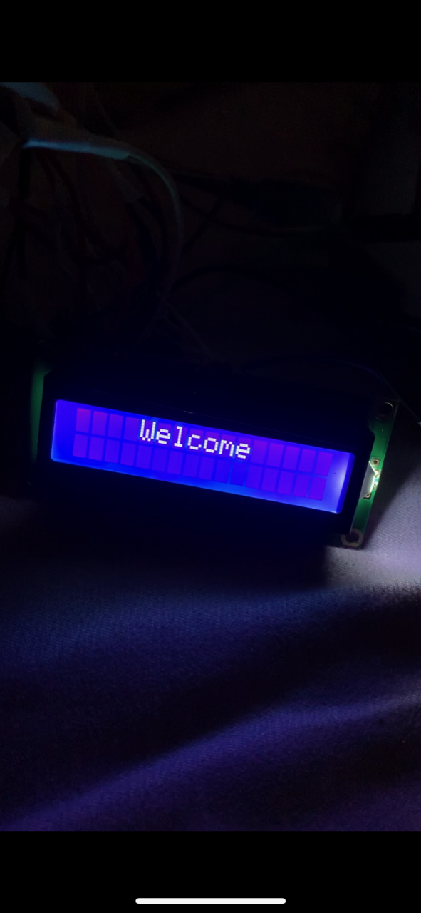
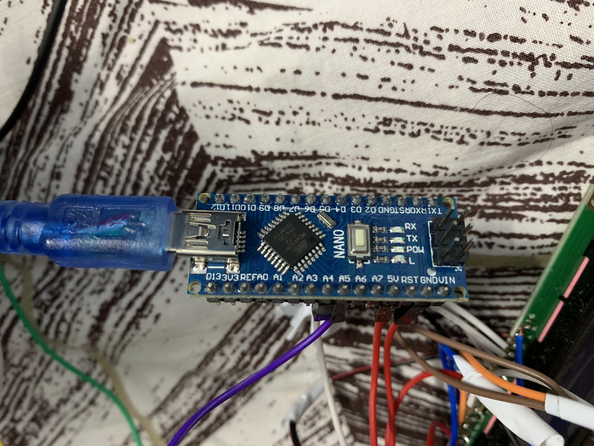
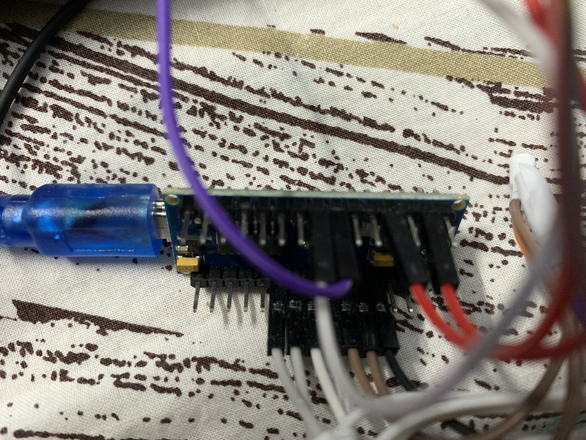

  <h1>Contactless IR Thermometer using Arduino with LCD</h1>
  
 
    
  

# Technologies
- **Arduino**: Backend to create the skills
- **Liquid Crystal Display**: To Display the skills

# Instruments

1. MLX90614 (GY906) Infrared non contact temperature sensor
2. Arduino Nano
3. Liquid Crystal OLEDDisplay
4. 1K Resistors

## How to use the features
Just Connect to a Mobile Adaptor or any Supply or Battery of 5v and then You can Check the Room Temperature and Human Body Temperature.

This Device is Specially Designed for Covid 19 to use as a resource
<table>
  <tr>
    <td>Welcome Screen</td>
     <td>Display Screen</td>
     <td>Temperature Screen</td>
  </tr>
  <tr>
    <td></td>
    <td></td>
    <td></td>
  </tr>
  <tr>
     <td>Arduino Nano</td>
     <td>MLX60514 IR Sensor</td>
     <td>Circuit Wiring</td>
  </tr>
  <tr>
    <td></td>
    <td></td>
    <td></td>
  </tr>
 
 </table>
 
